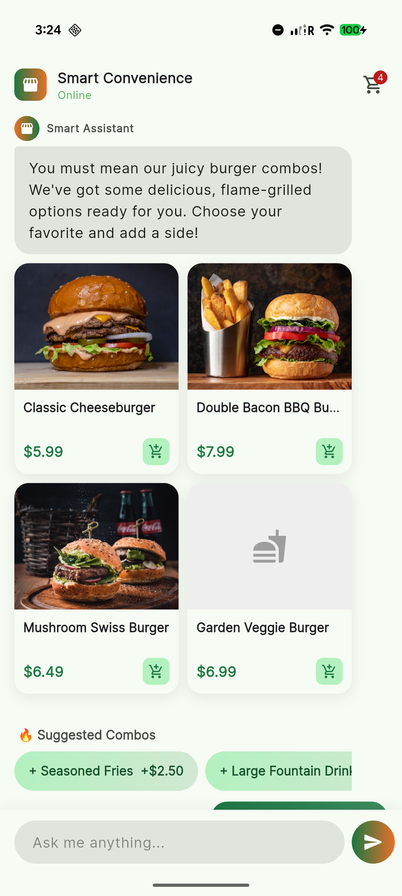
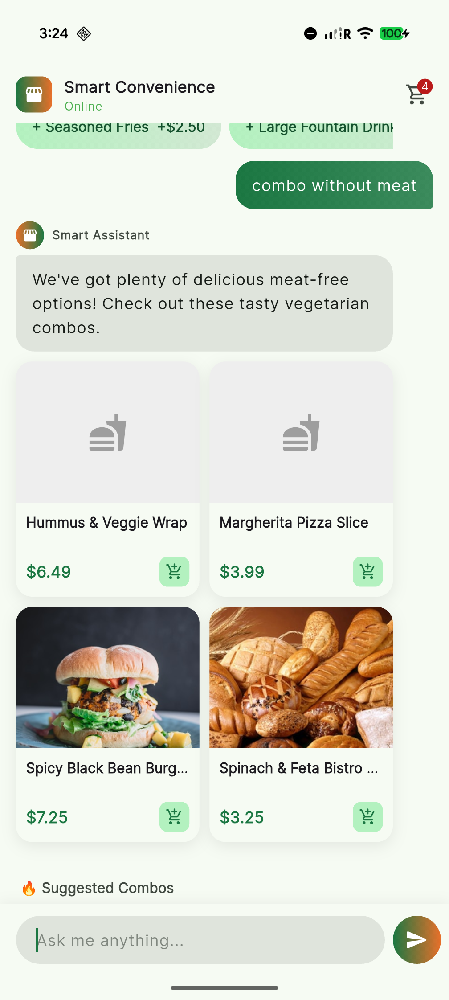

# Demo

[](https://www.youtube.com/watch?v=ncWYvyuigPY)

# Smart convenience

AI-Driven Convenience Store Interface: A generative chatbot featuring a backend-orchestrated UI and dynamic content generation.

## What is this?

- Quick tour of Generative UI
- How to use Generative UI
- How to build a Generative UI chatbot with Flutter
- BFF (Backend For Frontend) pattern for Generative UI

## Environment Variables
- `GEMINI_MODEL`: The model to use for the chatbot.
- `YOUR_GEMINI_KEY`: The API key for the model. How to get it? 👉 https://aistudio.google.com/


## How to run

```
flutter run --dart-define=GEMINI_MODEL=gemini-3-flash-preview --dart-define=GEMINI_KEY=YOUR_GEMINI_KEY
```

## Configuration

- Android: Add `GoogleService-Info.plist` to `ios/Runner/`
- iOS: Add `google-services.json` to `android/app/`

‼️ Ensure your app id matches with the one in the file.

## How about the context?

Let's try by yourself. ☺️




